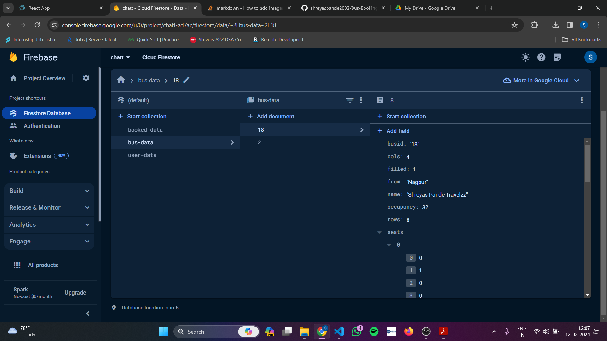

# BusBooking Application

Designed a end to end bus booking application using  React.js and Firebase

encorporated firebase for a couple of purposes like Authentication , Firestore DB , Hosting .

I have implemented the functionalities for two things:
1) Admin
2) User

This is the login page for the Bus App looks somethinglike this:

The Admin Dashboard :

The User Dashboard:

All the functioanlites of CRUD Operations and the UI are working correctly as per the requirement 

## The backend Database consists of 3 kinds of collections 
1) Bus Data
2) Ticket Booked Data
3) User Login Data

This is the screenshot of the firestore db

Inside the Admin Page we have the functionaltiies to :
1) Add New Bus Journey
2) Delete Bus Data
3) Update Bus Data

we keep track of a unique bus id for perforimng the CRUD operations and also for storing them in database with the help of these ids.

# Now for User Page 
we have the home  dashboard of user showing the current buses present  with number of seats left etc
we also have a filter button on source and destination to filter out corresponding buses.

then as we click on the book button a screen appears like this:

here we can go on for choosing the seat as per our wish 
the gray ones shows a already booked ones.

# Getting Started with Create React App

This project was bootstrapped with [Create React App](https://github.com/facebook/create-react-app).

## Available Scripts

In the project directory, you can run:

### `npm start`

Runs the app in the development mode.\
Open [http://localhost:3000](http://localhost:3000) to view it in your browser.

The page will reload when you make changes.\
You may also see any lint errors in the console.
