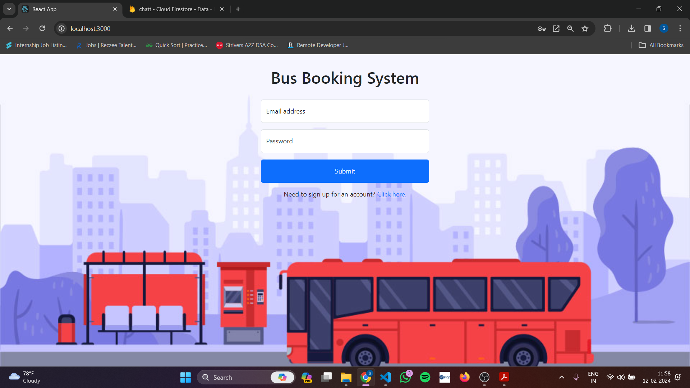
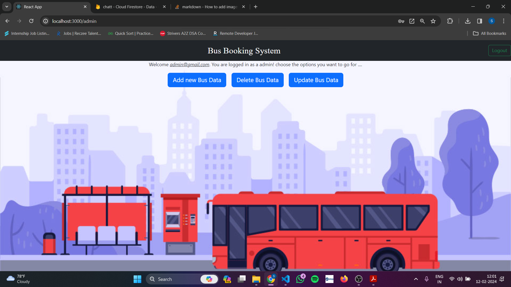
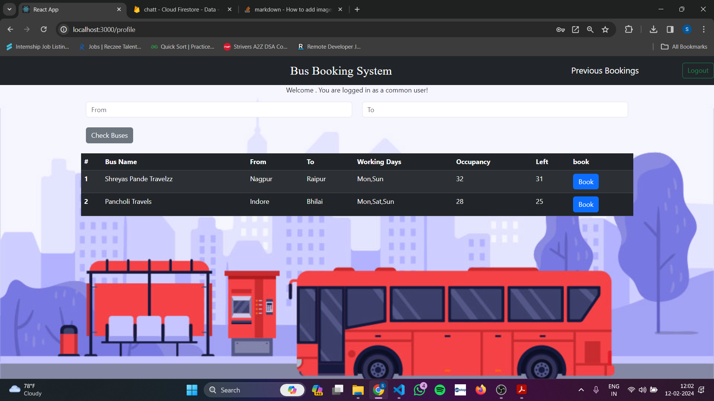

# BusBooking Application

Designed a end to end bus booking application using  React.js and Firebase

encorporated firebase for a couple of purposes like Authentication , Firestore DB , Hosting .

I have implemented the functionalities for two things:
1) Admin
2) User

This is the login page for the Bus App looks somethinglike this:

The Admin Dashboard :

The User Dashboard:

All the functioanlites of CRUD Operations and the UI are working correctly as per the requirement 

# Getting Started with Create React App

This project was bootstrapped with [Create React App](https://github.com/facebook/create-react-app).

## Available Scripts

In the project directory, you can run:

### `npm start`

Runs the app in the development mode.\
Open [http://localhost:3000](http://localhost:3000) to view it in your browser.

The page will reload when you make changes.\
You may also see any lint errors in the console.
